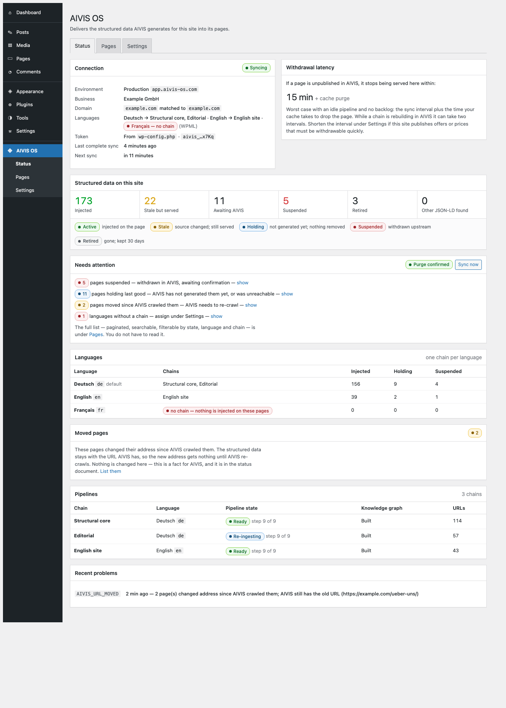

# AIVIS WordPress Connector

Delivers AIVIS-generated JSON-LD into WordPress pages — synced locally, injected at `wp_head`,
never fetched on a public request.

- **Plugin slug:** `aivis-os`
- **Requires:** WordPress 6.5–7.1, PHP 8.1–8.5
- **License:** GPL-2.0-or-later
- **API contract:** [AIVIS Public API 1.9.0](https://aivis-new.dev.onepoint.ro/api/public/v1/docs) (works down to 1.0.0; business-bound tokens need ≥ 1.3.0)

## Status

**Built, not yet piloted.** The plugin, its admin screens, WP-CLI, update
channel, release tooling and documentation are complete against the verified
API contract. What remains is [#18](https://github.com/epoint-digital/aivis-wordpress-connector/issues/18):
a pilot on an AIVIS-controlled site with a real page cache, the failure drills
in the runbook, and the `v1.0.0` tag. Work is tracked as GitHub issues and
milestones M1–M6.

```
aivis-os.php            bootstrap · Update URI · activation
src/
  Api/        Client, Response                  transport rules, status classification
  Security/   Envelope, Serializer, Binding     zero-trust pipeline (ZT-01…06)
  Sync/       Synchronizer, Decision, Lock, Scheduler, Gc, Verifier
  Delivery/   Gates, UrlResolver, Injector      the only code on a public request
  Cache/      CacheAdapter, PurgeResult, Adapters/…
  Storage/    Schema, Options, Repository
  Admin/      Menu, SettingsPage, StatusPage, Notices, SiteHealth
  Cli/        wp aivis …
  Update/     GitHubReleases
  reference/  JS reference for the decision rules and serializer (fuzzed)
tests/        JS unit + serializer fuzz + API contract (mock validated against OpenAPI)
tests/php/    PHPUnit
docs/         SPECIFICATION · API-REQUIREMENTS · INSTALL · RUNBOOK · KNOWN-ISSUES
```

## Documentation

| Document | Purpose |
|---|---|
| [docs/SPECIFICATION.md](docs/SPECIFICATION.md) | The source of truth — invariants, API contract, data model, retraction, delivery, acceptance criteria |
| [docs/API-REQUIREMENTS.md](docs/API-REQUIREMENTS.md) | Extensions requested from the AIVIS platform team |
| [docs/api-requirements.html](docs/api-requirements.html) | The requirements document handed to the AIVIS platform team — call patterns, load profile, and the eight asks. Published at [claude.ai/code/artifact/cfbb429c](https://claude.ai/code/artifact/cfbb429c-6415-497d-8d55-669fd0f8b5ef) |
| [docs/admin-ui.html](docs/admin-ui.html) | Clickable wp-admin prototype of the plugin screens, with every hard state reviewable. Published at [claude.ai/code/artifact/26186cd5](https://claude.ai/code/artifact/26186cd5-b590-4c4d-86a3-a1df1aa8d8c4) |
| [Program Map (FigJam)](https://www.figma.com/board/zQo3mgU7G8eRrVqsBa2LnP) | The four flows as one picture — sync loop, retraction decision tree, WordPress-behind-Cloudflare composition, API dependencies |

## Tests

```bash
npm test               # JS: 85 unit + serializer fuzz + 52 contract (offline)
./scripts/phpunit.sh   # PHPUnit (Docker if no local PHP)
./scripts/lint.sh      # php -l on every file (Docker if no local PHP)
```

The contract suite validates every mock response against AIVIS's own vendored
OpenAPI document, so a mis-shaped mock cannot pass. CI runs the JS suites on
Node 20/22/24, PHPUnit on PHP 8.1/8.3/8.5, and a version-consistency check;
a scheduled job diffs the vendored OpenAPI against the live one. See
[tests/README.md](tests/README.md).

## Install

Fifteen minutes: [docs/INSTALL.md](docs/INSTALL.md). Drills for when things go
wrong: [docs/RUNBOOK.md](docs/RUNBOOK.md).

## Distribution restriction (v1)

Use a **business-bound** AIVIS API token (created for one business; it reads nothing else) and the
plugin may run on customer-managed installs. An **account-wide** token reads every business on the
account, so it belongs only on sites the account holder controls. Settings shows which kind is
connected. See §00 and §13 of the specification.

## The screens



Status is an overview (is it healthy, what needs me), Pages is a paginated, searchable list (what about this page), Settings binds the site to its business, languages, cache and status key. Every screenshot in `docs/screenshots/` is rendered from `docs/admin-ui.html`, the prototype that mirrors `src/Admin`.

## Scope

The plugin is a delivery method. It holds facts only the site can know and performs actions only the site can perform; judgments, histories and policies live in AIVIS (specification WP-I12). If a change adds a decision to the plugin, it belongs in AIVIS instead.

## Install with an agent

Claude Code and Codex users: the `install-aivis-os` skill in this repository installs, connects and verifies the plugin — headless with WP-CLI (`wp aivis bind`, `wp aivis languages`, `wp aivis sync --all`) or by driving wp-admin in a browser. See `.claude/skills/install-aivis-os/SKILL.md`.

## Documentation index

Every document, page, board, test suite and issue set for the connector is listed in [docs/INDEX.md](docs/INDEX.md).
